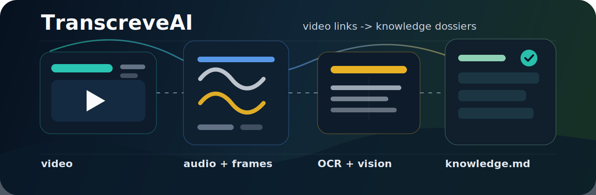

<p align="center">
  
</p>

<h1 align="center">TranscreveAI</h1>

<p align="center">
  <strong>Turn any video link into a searchable, multimodal knowledge dossier.</strong>
</p>

<p align="center">
  <a href="https://github.com/nikolasdehor/transcreve-ai/actions/workflows/ci.yml"></a>
  <a href="LICENSE"></a>
  
  
  
</p>

<p align="center">
  <a href="#quick-start">Quick Start</a>
  ·
  <a href="#what-it-builds">What It Builds</a>
  ·
  <a href="#example-output">Example Output</a>
  ·
  <a href="#agent-video-intelligence">Agent Video Intelligence</a>
  ·
  <a href="#architecture">Architecture</a>
  ·
  <a href="docs/CLI_REFERENCE.md">CLI Reference</a>
</p>

---

TranscreveAI is a small but serious pipeline for video intelligence. It does not stop at speech-to-text. It downloads the source video, extracts audio, samples frames, reads visible text with OCR, optionally asks AI to inspect key frames, and exports a clean dossier for humans and machines.

Use it when a video contains the kind of knowledge that gets lost in a plain transcript: tools shown on screen, UI flows, product names, prompts, dashboards, code snippets, visual steps, claims, and decisions.

```bash
transcreveai analyze "https://www.instagram.com/reel/..." --ai auto --language pt
```

## What It Builds

Every run produces a self-contained folder:

```text
outputs/20260601T060803Z-example/
  analysis.json      # structured data for indexing, RAG, search, dashboards
  knowledge.md       # readable dossier with summary, chapters and timeline
  source.mp4         # downloaded or copied source video
  audio.mp3          # extracted audio
  frames/            # timestamped frame evidence
```

The generated dossier includes:

| Layer | What TranscreveAI captures |
| --- | --- |
| Metadata | title, URL, channel/uploader, duration, upload date, description |
| Audio | extracted reviewable audio artifact |
| Transcript | timestamped speech segments when AI mode is enabled |
| Screen evidence | sampled frames across the video |
| OCR | visible text from slides, apps, comments, code, menus and dashboards |
| Visual notes | compact AI notes for selected frames |
| Knowledge synthesis | summary, chapters, entities, tools/products, claims, action items and open questions |

## Why It Exists

Most "video to text" workflows miss half the signal.

- The speaker says "click here", but the screen shows the actual tool and menu.
- A product, prompt, price or URL appears visually but is never spoken.
- A tutorial is valuable because of the sequence, not only the words.
- A knowledge base needs structured evidence, not a transcript blob.

TranscreveAI is built around the idea that video knowledge is multimodal by default.

## Agent Video Intelligence

TranscreveAI can also work as an agent capability: Codex, Claude Code or another local agent can inspect a video URL, run the pipeline, read the dossier, index it, and answer follow-up questions from the generated evidence.

```bash
transcreveai agent run "https://www.instagram.com/reel/..." \
  --question "quais ferramentas, passos e riscos aparecem no video?" \
  --json

# Creator Remix / Content Intelligence:
transcreveai agent run "https://www.instagram.com/reel/..." \
  --template content \
  --template skill \
  --json

# Batch para listas salvas de URLs/origens:
transcreveai agent batch ./sources.txt \
  --template content \
  --template skill \
  --strict \
  --json

# Or run each step manually:
transcreveai sources probe "https://www.instagram.com/reel/..." --json
transcreveai analyze "https://www.instagram.com/reel/..." --ai auto --language pt
transcreveai index <run_id>
transcreveai ask "quais ferramentas, passos e riscos aparecem no video?" --run-id <run_id>
```

Project artifacts:

- Agent skill: [`skills/transcreveai-video-intelligence/SKILL.md`](skills/transcreveai-video-intelligence/SKILL.md)
- Demo pack: [`docs/AGENT_VIDEO_INTELLIGENCE.md`](docs/AGENT_VIDEO_INTELLIGENCE.md)
- Source support matrix: [`docs/source-support-matrix.md`](docs/source-support-matrix.md)

Optional MCP server:

```bash
pip install 'transcreve-ai[mcp,rag]'
transcreveai-mcp
```

The MCP server exposes `sources_probe`, `analyze`, `agent_run`, `index`, `ask`,
`agent_batch`, `runs_list` and `runs_show`. The default transport is `stdio`; use
`transcreveai-mcp --transport streamable-http --port 8765` when a client expects
an HTTP MCP endpoint.

Register the server in MCP-capable clients with a stdio command like:

```json
{
  "mcpServers": {
    "transcreveai": {
      "command": "transcreveai-mcp",
      "args": ["--transport", "stdio"]
    }
  }
}
```

Validate the install with `transcreveai-mcp --help` before wiring it into Claude,
Codex or another agent client. Use `[mcp,rag]` when the client should also call
`index` and `ask`; `[mcp]` alone is enough for probe/analyze/run-only workflows.

Install the project skill in Codex:

```bash
mkdir -p ~/.codex/skills
cp -R skills/transcreveai-video-intelligence ~/.codex/skills/
```

Use this mode when the goal is not just a transcript, but a reusable playbook: tools/products shown on screen, prompts, steps, risks, open questions and timestamped evidence.

For creator/business videos, add `--template content`. It writes `content.md`,
`content.json` and `content.csv` next to `knowledge.md`, with a Creator Remix
package: evidence from the video, hook candidates, angles, short script, platform
variants, Notion/CSV fields and automation opportunities. Product/backlog notes
are explicitly marked as inference, separate from extracted evidence.

For videos about agents, prompts, Codex/Claude, automation or reusable workflows,
add `--template skill`. It writes `skill.md` and `skill.json`, turning the video
into a draft agent capability with triggers, inputs, steps, validation and
limitations.

## Quick Start

### 1. Install System Dependencies

Recommended:

- Python 3.10+ (`3.9` can run the current code, but some upstream tools already warn about deprecation)
- `ffmpeg`
- `yt-dlp`
- `tesseract`

On macOS:

```bash
brew install ffmpeg yt-dlp tesseract
```

On Ubuntu/Debian:

```bash
sudo apt-get update
sudo apt-get install -y ffmpeg tesseract-ocr
```

### 2. Install TranscreveAI

```bash
git clone https://github.com/nikolasdehor/transcreve-ai.git
cd transcreve-ai
python3 -m venv .venv
source .venv/bin/activate
pip install -e .
```

### 3. Optional: Enable AI

Local mode works without an API key. AI mode adds transcription, visual frame notes and synthesis.

```bash
cp .env.example .env
```

Then edit `.env`:

```bash
OPENAI_API_KEY=<your_openai_api_key>
VIDEO_KB_VISION_MODEL=gpt-4o-mini
VIDEO_KB_TRANSCRIBE_MODEL=whisper-1
```

### 4. Analyze A Video

```bash
transcreveai analyze "https://www.instagram.com/reel/..." --ai auto --language pt
```

For local files:

```bash
transcreveai analyze ./video.mp4 --ai auto
```

For platforms that require login:

```bash
transcreveai analyze "https://www.instagram.com/reel/..." --cookies-browser chrome --ai auto
```

## Example Output

`knowledge.md` is designed to be dropped into a knowledge base:

```md
# Video by creator

## Summary
The video demonstrates how to turn a reference clip and product image into a realistic short-form sales asset.

## Chapters
- 00:00 - Context and target video
- 00:30 - Collect source model and product references
- 00:58 - Upload inputs into the generation workflow
- 01:34 - Adjust and export the image
- 02:04 - Run motion transfer and prepare for publishing

## Timeline
### 01:14
- Speech: "Use image, 9x16, Nano Banana Pro..."
- OCR: "Nano Banana Pro", "generation will use credits"
- Visual: settings panel for image generation, aspect ratio selection, prompt workflow
```

`analysis.json` keeps the same information in structured form for indexing, search or RAG.

## CLI Examples

Balanced analysis:

```bash
transcreveai analyze "https://youtu.be/..." \
  --out outputs \
  --frame-interval 4 \
  --max-frames 80 \
  --visual-limit 30 \
  --ai auto \
  --language pt
```

Local-only, cheaper and private:

```bash
transcreveai analyze ./video.mp4 --ai off --frame-interval 3 --max-frames 60
```

More selective AI vision:

```bash
transcreveai analyze "https://youtu.be/..." --ai auto --max-frames 120 --visual-limit 16
```

## Historico e Storage

### Historico de runs

Cada execucao e registrada automaticamente num banco SQLite em `~/.transcreveai/index.db`. Use o subcomando `runs` para consultar e gerenciar o historico:

```bash
# Listar os 20 runs mais recentes
transcreveai runs list

# Listar em JSON (integravel com jq, scripts, etc.)
transcreveai runs list --json

# Exibir detalhes de um run especifico
transcreveai runs show <run_id>

# Remover um run do indice
transcreveai runs rm <run_id>

# Remover do indice E apagar o diretorio de saida do disco
transcreveai runs rm <run_id> --purge

# Remover sem confirmacao interativa
transcreveai runs rm <run_id> --force
```

O path do banco pode ser alterado por variavel de ambiente ou flag global:

```bash
VIDEO_KB_INDEX_DB=~/meu-projeto/index.db transcreveai runs list
transcreveai --index-db ~/meu-projeto/index.db runs list
```

### Dedupe automatico

O TranscreveAI calcula um SHA-256 de cada fonte (URL ou arquivo) antes de processar. Se um run com o mesmo hash ja existir no indice, o pipeline exibe uma mensagem e encerra sem reprocessar:

```
Pulando: run '20260601T...' ja existe em 'outputs/...'.
Use --force para reprocessar mesmo assim.
```

Para forcar o reprocessamento:

```bash
transcreveai analyze "https://youtu.be/..." --force
```

### Backends de storage

Por padrao os artefatos ficam no diretorio de saida local (`--out`). Use `--storage` para enviar para outros destinos:

```bash
# Exportar para vault do Obsidian
transcreveai analyze "https://youtu.be/..." --storage obsidian

# Criar pagina no Notion
transcreveai analyze "https://youtu.be/..." --storage notion

# Upload para bucket S3
transcreveai analyze "https://youtu.be/..." --storage s3

# Definir backend padrao via variavel de ambiente
VIDEO_KB_STORAGE=obsidian transcreveai analyze "https://youtu.be/..."
```

| Backend | Extra necessario | Env vars obrigatorias |
|---|---|---|
| `filesystem` (padrao) | nenhum | - |
| `obsidian` | `transcreve-ai[obsidian]` | `VIDEO_KB_OBSIDIAN_VAULT` |
| `notion` | `transcreve-ai[notion]` | `NOTION_API_KEY`, `NOTION_DATABASE_ID` |
| `supabase` | `transcreve-ai[supabase]` | `SUPABASE_URL`, `SUPABASE_KEY` |
| `s3` | `transcreve-ai[s3]` | `VIDEO_KB_S3_BUCKET` + credenciais AWS |

> Nota: o backend `supabase` esta marcado como fase futura e ainda nao foi implementado. Selecionar `--storage supabase` levanta `NotImplementedError`. Use `filesystem` (padrao), `obsidian`, `notion` ou `s3` por enquanto.

Instale o extra desejado antes de usar:

```bash
pip install transcreve-ai[obsidian]
pip install transcreve-ai[notion]
pip install transcreve-ai[s3]
```

#### Variaveis de ambiente de storage

| Variavel | Descricao |
|---|---|
| `VIDEO_KB_STORAGE` | Backend padrao quando `--storage` nao e passado |
| `VIDEO_KB_INDEX_DB` | Path do banco SQLite de indice (default: `~/.transcreveai/index.db`) |
| `VIDEO_KB_OBSIDIAN_VAULT` | Caminho absoluto da vault Obsidian |
| `VIDEO_KB_OBSIDIAN_SUBDIR` | Subpasta dentro da vault (default: `transcreve-ai`) |
| `NOTION_API_KEY` | Token de integracao interna do Notion |
| `NOTION_DATABASE_ID` | UUID do banco de dados Notion destino |
| `VIDEO_KB_S3_BUCKET` | Nome do bucket S3 |
| `VIDEO_KB_S3_PREFIX` | Prefixo/pasta dentro do bucket (opcional) |
| `AWS_DEFAULT_REGION` | Regiao AWS (default: `us-east-1`) |
| `AWS_ENDPOINT_URL` | Endpoint S3-compatible: Minio, LocalStack, etc. |

---

## Providers / Modelos

TranscreveAI suporta multiplos providers de IA. Use `--provider` para escolher:

```bash
transcreveai analyze "https://youtu.be/..." --provider gemini --language pt
```

| Provider | Transcricao | Visao | Sintese | Embeddings | Requer |
|---|:---:|:---:|:---:|:---:|---|
| `openai` (padrao) | sim | sim | sim | sim | `OPENAI_API_KEY` |
| `local` | sim | nao | sim | sim | nenhuma (offline/gratuito) |
| `gemini` | sim | sim | sim | sim | `GEMINI_API_KEY` |
| `anthropic` | condicional | sim | sim | nao | `ANTHROPIC_API_KEY` |

O provider tambem pode ser definido por variavel de ambiente. Precedencia: `--provider` > `VIDEO_KB_PROVIDER` > `openai`.

### Modo offline/gratuito

```bash
pip install transcreve-ai[local]
transcreveai analyze ./video.mp4 --provider local --ai auto
```

Usa `faster-whisper` para transcricao e `sentence-transformers` para embeddings, sem chamadas de rede.
O modelo Whisper pode ser ajustado com `VIDEO_KB_LOCAL_WHISPER_MODEL` (padrao: `base`).

### Extras de instalacao

```bash
pip install transcreve-ai[local]      # offline/gratuito: faster-whisper + sentence-transformers
pip install transcreve-ai[gemini]     # Google Gemini: google-generativeai
pip install transcreve-ai[anthropic]  # Anthropic: anthropic SDK
```

### Variaveis de ambiente relevantes

| Variavel | Descricao |
|---|---|
| `VIDEO_KB_PROVIDER` | Provider padrao quando `--provider` nao e passado |
| `OPENAI_API_KEY` | Chave para o provider `openai` |
| `GEMINI_API_KEY` | Chave para o provider `gemini` (aceita `GOOGLE_API_KEY` como fallback) |
| `ANTHROPIC_API_KEY` | Chave para o provider `anthropic` |
| `VIDEO_KB_LOCAL_WHISPER_MODEL` | Modelo faster-whisper para o provider `local` (padrao: `base`) |

## Busca semantica (RAG)

Apos analisar videos, voce pode indexar o conteudo e fazer perguntas em linguagem natural. O sistema divide cada dossie em chunks, gera embeddings e persiste tudo em SQLite local. A busca e feita por similaridade cosine.

### Instalacao

```bash
pip install 'transcreve-ai[rag]'
```

Para usar o provider offline `local` (sem chamadas de rede):

```bash
pip install 'transcreve-ai[rag]' 'transcreve-ai[local]'
```

### Indexar videos

```bash
# Indexar um run especifico
transcreveai index <run_id>

# Indexar todos os runs ainda nao indexados
transcreveai index --all

# Forcar reindexacao com provider diferente
transcreveai index --all --provider gemini --force
```

### Buscar e perguntar

```bash
# Busca semantica (retorna trechos, sem LLM)
transcreveai ask "ferramentas mostradas no video" --search-only

# RAG completo: recupera trechos e gera resposta
transcreveai ask "o que foi dito sobre autenticacao?"

# Limitar busca a runs especificos
transcreveai ask "qual e o fluxo de cadastro?" --run-id <run_id1> --run-id <run_id2>

# Usar provider offline (sem custo de API)
transcreveai ask "resumo dos capitulos" --provider local
```

### Embeddings locais (offline) vs. providers externos

| Provider | Modelo de embedding | Offline | Requer |
|---|---|:---:|---|
| `openai` | `text-embedding-3-small` | Nao | `OPENAI_API_KEY` |
| `local` | `all-MiniLM-L6-v2` (sentence-transformers) | Sim | `transcreve-ai[local]` |
| `gemini` | `text-embedding-004` | Nao | `GEMINI_API_KEY` |

O provider `local` usa `sentence-transformers` com o modelo `all-MiniLM-L6-v2`. Nao faz chamadas de rede para gerar embeddings - util para uso offline, privacidade ou controle de custo.

### Busca pela interface web

Na interface web (`transcreveai serve`), acesse `/search` para usar a busca semantica no navegador. A pagina oferece dois modos:

- Busca de trechos: retorna os chunks mais similares com score, tipo e trecho do texto
- Gerar resposta com IA: chama o RAG completo e exibe a resposta sintetizada com as fontes

A busca web usa o provider configurado em `VIDEO_KB_PROVIDER` (ou `openai` como fallback).

---

## Avaliacao (eval)

O subcomando `eval` roda o pipeline completo em um conjunto de videos de referencia e compara providers lado a lado em qualidade, custo e latencia.

> Nota de implementacao: esta secao acompanha o workflow de eval que esta sendo integrado. Antes de usar, confirme que o checkout atual expoe `transcreveai eval --help`. O provider `local` depende do extra `[local]`; providers remotos dependem das chaves e extras correspondentes.

```bash
# Smoke-test local, sem custo de API
transcreveai eval --providers local

# Comparar dois providers
transcreveai eval --providers openai,gemini

# Com dataset customizado
transcreveai eval --dataset meus-videos.json --providers openai,gemini
```

Ao final, o harness grava em `eval-report/<timestamp>/`:

- `report.md` - tabela de metricas por caso e por provider, resumo com medias e recomendacao de melhor custo-beneficio
- `results.json` - dados brutos estruturados para automacoes e comparacoes historicas

### Comparando providers (qualidade / custo / latencia)

| Dimensao | O que o eval mede |
|---|---|
| Qualidade da transcricao | WER (Word Error Rate) contra ground-truth, quando disponivel no dataset |
| Qualidade da sintese | Nota do judge LLM em cobertura, coerencia e utilidade (opcional, ver abaixo) |
| Custo estimado | Estimativa heuristica em USD por run (Whisper + visao + sintese) |
| Latencia | Tempo total de parede e por etapa (download, OCR, IA, persistencia) |
| Completude estrutural | Contagem de capitulos, entidades, ferramentas, afirmacoes e itens de acao gerados |

Use `--providers openai,gemini,local` para ver todos lado a lado no mesmo relatorio.

### Judge opcional (LLM-as-judge)

O flag `--judge PROVIDER` ativa avaliacao qualitativa da sintese gerada. O provider informado pontua cada sintese em tres criterios (0-10): cobertura de topicos, coerencia logica e utilidade das entidades e acoes extraidas.

```bash
transcreveai eval --providers openai,gemini --judge openai
```

O judge e desativado por padrao. Qualquer provider que suporte sintese pode ser usado como judge.

### Atencao: o eval usa APIs reais (custo)

Rodar `transcreveai eval` com providers pagos (`openai`, `gemini`, `anthropic`) faz chamadas reais as APIs e incorre em custo. O CLI exibe um aviso e pede confirmacao antes de iniciar. Para suprimir a confirmacao em CI/CD:

```bash
transcreveai eval --providers openai --no-cost-warning
```

Para estimar o custo antes de rodar: o dataset padrao tem ~4 min de video. Com `openai` em modo `full`, o custo tipico e em torno de $0.03 por provider. Com `--judge` ativado, adicione ~$0.01 por caso avaliado. Esses valores sao estimativas - consulte `video_kb/eval/cost_table.py` e os sites dos providers para precos atualizados.

O provider `local` nao faz chamadas de rede e tem custo zero. E util para validar o harness e testar datasets sem gastar creditos de API.

Consulte [docs/superpowers/specs/eval-harness-design.md](docs/superpowers/specs/eval-harness-design.md) para detalhes completos do design, formato do dataset e estrutura dos relatorios.

---

## Architecture

```text
URL or file
  -> yt-dlp download/copy
  -> ffprobe metadata
  -> ffmpeg audio extraction
  -> ffmpeg frame sampling
  -> tesseract OCR
  -> optional AI transcription  (provider escolhido)
  -> optional AI visual frame notes  (provider escolhido)
  -> optional AI synthesis  (provider escolhido)
  -> analysis.json + knowledge.md
```

See [docs/ARCHITECTURE.md](docs/ARCHITECTURE.md) for a deeper walkthrough.

## Interface Web

A interface web e um extra opcional que expoe o pipeline por meio de uma API HTTP e serve
uma SPA React para analise interativa de videos.

### Instalacao e inicio

```bash
pip install 'transcreve-ai[web]'
transcreveai serve
```

Acesse `http://localhost:8000` no navegador.

### Flags do comando `serve`

```bash
transcreveai serve [--host HOST] [--port PORT] [--out DIR] [--reload]
```

| Flag | Descricao | Default |
|---|---|---|
| `--host` | Endereco de bind | `127.0.0.1` |
| `--port` | Porta | `8000` |
| `--out` | Diretorio de saida dos jobs | `outputs` |
| `--reload` | Hot-reload (apenas desenvolvimento) | `false` |

### Construir o frontend

O repositorio inclui o codigo-fonte do frontend em `frontend/`. Para gerar os arquivos
estaticos que o servidor serve em producao:

```bash
cd frontend && pnpm build
```

O resultado e gravado em `frontend/dist/`. O servidor detecta automaticamente esse
diretorio e serve a SPA.

Para desenvolvimento do frontend com hot-reload:

```bash
cd frontend && pnpm dev
```

O Vite sobe em `localhost:5173` e faz proxy de `/api/*` para `localhost:8000` (o backend
deve estar rodando em paralelo).

### Fluxo de uso

1. **Submeter** - cole um link ou arraste um arquivo na pagina inicial, escolha o provider
   e o modo de IA e clique em analisar.
2. **Acompanhar** - a pagina do job exibe uma barra de progresso e uma timeline de etapas
   atualizadas em tempo real via SSE (Server-Sent Events).
3. **Historico** - a pagina inicial lista todos os jobs anteriores, incluindo os registrados
   pelo CLI. Clicar em um job abre o detalhe ou o dossie.
4. **Dossie** - ao concluir, a pagina exibe o dossie completo: resumo, capitulos, entidades,
   ferramentas, afirmacoes e o `knowledge.md` renderizado.

---

## Automation Shape

The CLI is intentionally worker-friendly:

1. A webhook receives `{ "url": "..." }`.
2. A queue starts `transcreveai analyze "$url" --ai auto`.
3. `analysis.json` is indexed into a knowledge base.
4. `knowledge.md` is saved to Git, Obsidian, Notion, Drive or returned in chat.

Future versions can wrap the same core with a web UI, background jobs and storage adapters.

## Project Status

TranscreveAI is early but usable:

- CLI is functional.
- Local extraction works without AI.
- AI transcription, visual notes and synthesis work when configured.
- CI runs on Python 3.10, 3.11 and 3.12.
- Outputs are intentionally file-based for portability.

See [ROADMAP.md](ROADMAP.md) for what comes next.

## Privacy And Security

- `.env` is ignored by Git and should stay local.
- `outputs/` is ignored because it may contain videos, audio, screenshots and private context.
- Do not commit downloaded media or real user dossiers.
- Rotate API keys that appeared in chat, logs, screenshots or shell history.
- For production, use provider secrets instead of local `.env` files.

See [SECURITY.md](SECURITY.md).

## Development

```bash
python -m ruff check video_kb tests
python -m ruff check --select C90 video_kb tests  # warning while complexidade ainda está em estabilização
python -m mypy video_kb tests  # warning enquanto erros de tipagem legado ainda existem
python -m pytest --maxfail=1 --cov=video_kb --cov-report=term-missing --cov-report=xml:coverage.xml
python -m unittest discover -s tests
python -m compileall video_kb tests
cd frontend && pnpm install --frozen-lockfile && pnpm lint && pnpm build
```

Contributions are welcome. Start with [CONTRIBUTING.md](CONTRIBUTING.md), [docs/CLI_REFERENCE.md](docs/CLI_REFERENCE.md) and [docs/OPEN_SOURCE_CHECKLIST.md](docs/OPEN_SOURCE_CHECKLIST.md).

## License

MIT. See [LICENSE](LICENSE).
